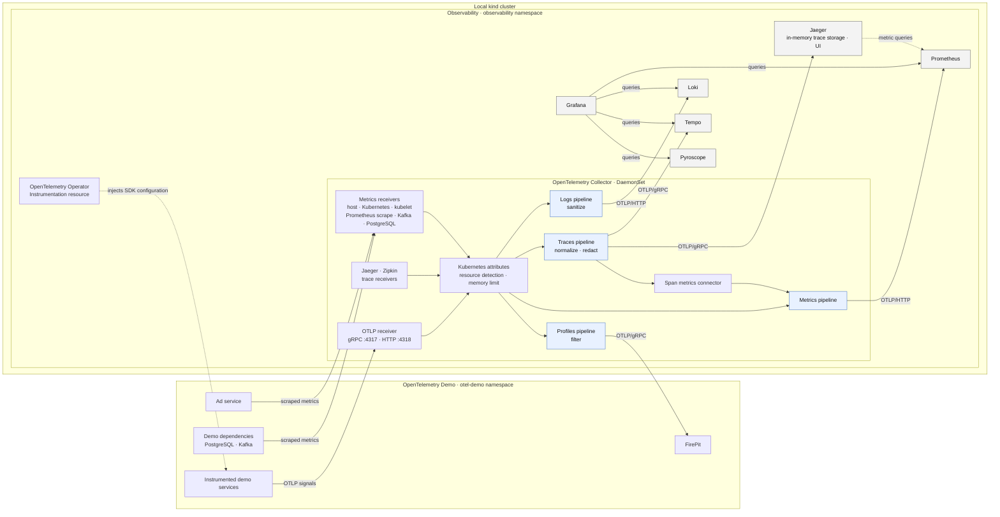

# Telemetry architecture

This diagram shows the telemetry paths in the local `kind` cluster. Argo CD
deploys the demo and observability components from the manifests under
`environments/`; this focuses on runtime telemetry flow.

The Operator injects SDK configuration into annotated workloads. The shared
Instrumentation resource points SDKs at the Collector; most use OTLP/HTTP with
protobuf on port `4318`, while some existing demo workloads use OTLP/gRPC on
`4317`.

The Collector also gathers host and Kubernetes metrics, scrapes the demo's Ad
service, and collects PostgreSQL and Kafka metrics. It exports traces to both
Tempo and Jaeger, and derives span metrics that join the metrics pipeline.
Jaeger keeps traces in memory and uses Prometheus for metric queries.

Grafana is configured to query Prometheus, Loki, Tempo, and Pyroscope.
Currently, the Collector's profiles pipeline exports to the demo's FirePit
service; no profile export to Pyroscope is configured.
